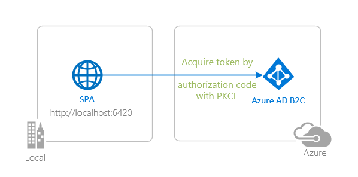
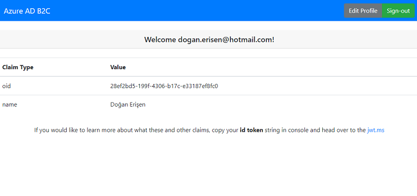

| In this Tutorial | Previous Chapter | Next Chapter |
|------------------|------------------|----------------|
| authentication, id tokens, user-flows | [Sign-in with Azure AD](https://github.com/Azure-Samples/ms-identity-javascript-tutorial/tree/master/1-Authentication/1-1-sign-in) | [Call Microsoft Graph](https://github.com/Azure-Samples/ms-identity-javascript-tutorial/tree/master/2-Authorization-I/1-1-call-graph) |

# Vanilla JavaScript Single-page Application (SPA) using MSAL.js to authenticate users against Azure AD B2C

 1. [Overview](#overview)
 1. [Scenario](#scenario)
 1. [Contents](#contents)
 1. [Prerequisites](#prerequisites)
 1. [Setup](#setup)
 1. [Registration](#registration)
 1. [Running the sample](#running-the-sample)
 1. [Explore the sample](#explore-the-sample)
 1. [About the code](#about-the-code)
 1. [Deployment](#deployment)
 1. [More information](#more-information)
 1. [Community Help and Support](#community-help-and-support)
 1. [Contributing](#contributing)
 1. [Code of Conduct](#code-of-conduct)

## Overview

This sample demonstrates a Vanilla JavaScript single-page application (SPA) that lets users sign-in with [Azure Active Directory B2C](https://azure.microsoft.com/services/active-directory/external-identities/b2c/) using the [Microsoft Authentication Library for JavaScript)](https://github.com/AzureAD/microsoft-authentication-library-for-js) (MSAL.js). In doing so, it also illustrates various authentication and **B2C** concepts, such as [ID tokens](https://docs.microsoft.com/azure/active-directory-b2c/tokens-overview#token-types), [external identity providers](https://docs.microsoft.com/azure/active-directory-b2c/technical-overview#external-identity-providers) , [consumer social accounts](https://docs.microsoft.com/azure/active-directory-b2c/technical-overview#consumer-accounts), [single-sign on (SSO)](https://docs.microsoft.com/azure/active-directory-b2c/session-overview), **account selection**, **silent requests** and more.



## Scenario

1. The client application uses **MSAL.js** to obtain an [ID token](https://docs.microsoft.com/azure/active-directory-b2c/tokens-overview#token-types) from **Azure AD B2C**.
2. The **ID Token** proves that the user has successfully authenticated against **Azure AD B2C**.

## Contents

| File/folder           | Description                                |
|-----------------------|--------------------------------------------|
| `App/authPopup.js`    | Main authentication logic resides here (using popup flow). |
| `App/authRedirect.js` | Use this instead of `authPopup.js` for authentication with redirect flow. |
| `App/authConfig.js`   | Contains configuration parameters for the sample. |
| `App/ui.js`           | Contains UI logic.                         |
| `server.js`           | Simple Node server to `index.html`.        |

## Prerequisites

- [Node.js](https://nodejs.org/en/download/) must be installed to run this sample.
- A modern web browser. This sample uses **ES6** conventions and will not run on **Internet Explorer**.
- [Visual Studio Code](https://code.visualstudio.com/download) is recommended for running and editing this sample.
- [VS Code Azure Tools](https://marketplace.visualstudio.com/items?itemName=ms-vscode.vscode-node-azure-pack) extension is recommended for interacting with Azure through VS Code Interface.
- An Azure Active Directory B2C (Azure AD B2C) tenant. For more information on how to get an Azure AD tenant, see: [Create an Azure Active Directory B2C tenant](https://docs.microsoft.com/azure/active-directory-b2c/tutorial-create-tenant)
- A user account in your Azure AD B2C tenant.

## Setup

### Step 1: Clone or download this repository

From your shell or command line:

```console
git clone https://github.com/Azure-Samples/ms-identity-javascript-tutorial.git
```

or download and extract the repository .zip file.

> :warning: Given that the name of the sample is quite long, and so are the names of the referenced packages, you might want to clone it in a folder close to the root of your hard drive, to avoid maximum file path length limitations on Windows.

### Step 2: Install project dependencies

```console
    cd 1-Authentication/1-2-sign-in-b2c
    npm install
```

## Registration

:warning: This sample comes with a pre-registered application for testing purposes. If you would like to use your own **Azure AD B2C** tenant and application, follow the steps below to register and configure the application in the **Azure Portal**. Otherwise, continue with the steps for [Running the sample](#running-the-sample).

### Choose the Azure AD B2C tenant where you want to create your applications

As a first step you'll need to:

1. Sign in to the [Azure portal](https://portal.azure.com).
1. If your account is present in more than one Azure AD B2C tenant, select your profile at the top right corner in the menu on top of the page, and then **switch directory** to change your portal session to the desired Azure AD B2C tenant.

If you don't have an Azure AD B2C tenant yet, please see: [Tutorial: Create an Azure Active Directory B2C tenant](https://docs.microsoft.com/azure/active-directory-b2c/tutorial-create-tenant).

#### Register the app (ms-identity-b2c-javascript-signin)

1. Navigate to the Microsoft identity platform for developers [App registrations](https://go.microsoft.com/fwlink/?linkid=2083908) page.
1. Select **New registration**.
1. In the **Register an application page** that appears, enter your application's registration information:
   - In the **Name** section, enter a meaningful application name that will be displayed to users of the app, for example `ms-identity-b2c-javascript-signin`.
   - Under **Supported account types**, select **Accounts in any organizational directory or any identity provider. For authenticating users with Azure AD B2C**.
   - In the **Redirect URI (optional)** section, select **Single-Page Application** in the combo-box and enter the following redirect URI: `http://localhost:6420/`.
1. Select **Register** to create the application.
1. In the app's registration screen, find and note the **Application (client) ID**. You use this value in your app's configuration file(s) later in your code.
1. Select **Save** to save your changes.

### Create User Flows and Custom Policies

Please refer to: [Tutorial: Create user flows in Azure Active Directory B2C](https://docs.microsoft.com/azure/active-directory-b2c/tutorial-create-user-flows)

### Add External Identity Providers

Please refer to: [Tutorial: Add identity providers to your applications in Azure Active Directory B2C](https://docs.microsoft.com/azure/active-directory-b2c/tutorial-add-identity-providers)

#### Configure the app (ms-identity-b2c-javascript-signin) to use your app registration

Open the project in your IDE (like Visual Studio or Visual Studio Code) to configure the code.

> In the steps below, "ClientID" is the same as "Application ID" or "AppId".

1. Open the `App\authConfig.js` file.
1. Find the key `clientId` and replace the existing value with the application ID (clientId) of the `ms-identity-b2c-javascript-signin` application copied from the Azure portal.
1. Find the key `redirectUri` and replace the existing value with the base address of the ms-identity-b2c-javascript-signin project (by default `http://localhost:6420`).
1. Find the key `postLogoutRedirectUri` and replace the existing value with the base address of the ms-identity-b2c-javascript-signin project and the **signout** page that the app will redirect to e.g. `http://localhost:6420/signout`.

1. Open the `App\policies.js` file.
1. Find the key `names` and populate it with your policy names e.g. `signUpSignIn`.
1. Find the key `authorities` and populate it with your policy authority strings e.g. `https://<your-tenant-name>.b2clogin.com/<your-tenant-name>.onmicrosoft.com/b2c_1_susi`.
1. Find the key `authorityDomain` and populate it with the domain portion of your authority string e.g. `<your-tenant-name>.b2clogin.com`.

## Running the sample

```console
    cd cd 1-Authentication/1-2-sign-in-b2c
    npm start
```

## Explore the sample

1. Open your browser and navigate to `http://localhost:6420`.
1. Click on the **sign-in** button on the top right corner.



> :thought_balloon: Consider taking a moment to [share your experience with us](https://forms.office.com/Pages/ResponsePage.aspx?id=v4j5cvGGr0GRqy180BHbR73pcsbpbxNJuZCMKN0lURpUNDVHTkg2VVhWMTNYUTZEM05YS1hSN01EOSQlQCN0PWcu).

## About the code

## Sign-in

MSAL.js provides 3 login APIs: `loginPopup()`, `loginRedirect()` and `ssoSilent()`:

```javascript
    myMSALObj.loginPopup(loginRequest)
        .then((response) => {
            // your logic
        })
        .catch(error => {
            console.error(error);
        });
```

To use the redirect flow, you must register a handler for redirect promise. **MSAL.js** provides `handleRedirectPromise()` API:

```javascript
    myMSALObj.handleRedirectPromise()
        .then((response) => {
            // your logic
        })
        .catch(err => {
            console.error(err);
        });

    myMSALObj.loginRedirect(loginRequest);
```

The recommended pattern is that you fallback to an **interactive method** should the silent SSO fails.

```javascript

    const silentRequest = {
      scopes: ["openid", "profile"],
      loginHint: "example@domain.net"
    };

    myMSALObj.ssoSilent(silentRequest)
        .then((response) => {
            // your logic
        }).catch(error => {
            console.error("Silent Error: " + error);
            if (error instanceof msal.InteractionRequiredAuthError) {
                myMSALObj.loginRedirect(loginRequest);
            }
        });
```

You can pass custom query string parameters to your sign-in request, using the `extraQueryParameters` property. For instance, in order to customize your B2C user interface, you can:

```javascript
    const loginRequest = {
      scopes: ["openid", "profile"],
      extraQueryParameters: { campaignId: 'hawaii', ui_locales: 'es' }
    };

    myMSALObj.loginRedirect(loginRequest);
```

See here for more: [Customize the user interface of your application in Azure AD B2C](https://docs.microsoft.com/azure/active-directory-b2c/custom-policy-ui-customization)

You can get all the active accounts of a signed-in user with the get `getAllAccounts()` API. If you know the **home ID** of an account, you can select it by:

```javascript
    myMSALObj.getAccountByHomeId(homeId);
```

> :warning: MSAL.js also provides a `getAccountByUsername()` API, which is not recommended with B2C as the B2C server may not return a username and as such, **home ID** is a more robust identifier to select an account.

### Sign-out

The application redirects the user to the **Microsoft identity platform** logout endpoint to sign out. This endpoint clears the user's session from the browser. If your app did not go to the logout endpoint, the user may re-authenticate to your app without entering their credentials again, because they would have a valid single sign-in session with the **Microsoft identity platform** endpoint. See for more: [Send a sign-out request](https://docs.microsoft.com/azure/active-directory/develop/v2-protocols-oidc#send-a-sign-out-request).

The sign-out clears the user's single sign-on session with **Azure AD B2C**, but it might not sign the user out of their **social identity provider** session. If the user selects the same identity provider during a subsequent sign-in, they might re-authenticate without entering their credentials. Here the assumption is that, if a user wants to sign out of the application, it doesn't necessarily mean they want to sign out of their social account (e.g. Facebook) itself.

### ID Token validation

A single-page application does not benefit from validating ID tokens, since the application runs without a back-end and as such, attackers can intercept and edit the keys used for validation of the token.

### Integrating user-flows

- **Sign-up/sign-in**

This user-flow allows your users to sign-in to your application if the user has an account already, or sign-up for an account if not. This is the default user-flow that we pass during the initialization of MSAL instance.

- **Password reset**

When a user clicks on the **forgot your password?** link during sign-in, **Azure AD B2C** will throw an error. To initiate the password reset user-flow, you need to catch this error and handle it by sending another login request with the corresponding password reset authority string.

```javascript
    myMSALObj.loginPopup(loginRequest)
        .then(handleResponse)
        .catch(error => {
            console.error(error);

            if (error.errorMessage) {
                if (error.errorMessage.indexOf("AADB2C90118") > -1) {
                myMSALObj.loginPopup(b2cPolicies.authorities.forgotPassword)
                    .then(response => {
                        console.log(response);
                        window.alert("Password has been reset successfully. \nPlease sign-in with your new password.");
                    })
                }
            }
    });
```

In case if you are using redirect flow, you should catch the error inside `handleRedirectPromise()`:

```javascript
    myMSALObj.handleRedirectPromise()
        .then(handleResponse)
        .catch(error => {
            console.error(error);

            if (error.errorMessage.indexOf("AADB2C90118") > -1) {
                try {
                    myMSALObj.loginRedirect(b2cPolicies.authorities.forgotPassword);
                } catch(err) {
                    console.log(err);
                }
            }
        });
```

Then, in `handleResponse()`:

```javascript
    function handleResponse(response) {
        if (response !== null) {

            if (response.idTokenClaims['acr'] === b2cPolicies.names.forgotPassword) {
                window.alert("Password has been reset successfully. \nPlease sign-in with your new password.");

                const logoutRequest = {
                    account: myMSALObj.getAccountByHomeId(accountId),
                    postLogoutRedirectUri: "http://localhost:6420"
                };

                myMSALObj.logout(logoutRequest);
            } else if (response.idTokenClaims['acr'] === b2cPolicies.names.editProfile) {
                window.alert("Profile has been updated successfully.");
            } else {
                // sign-in as usual
            }
        }
    }
```

- **Edit Profile**

Unlike password reset, edit profile user-flow does not require users to sign-out and sign-in again. Instead, **MSAL.js** will handle
switching back to the authority string of the default user-flow automatically.

```javascript
    myMSALObj.loginPopup(b2cPolicies.authorities.editProfile)
        .then(response => {
            console.log(response);
            // your logic here
        });
```

## More information

Configure your application:

- [Use Microsoft Authentication Library for JavaScript to work with Azure AD B2C](https://docs.microsoft.com/azure/active-directory/develop/msal-b2c-overview)
- [Tutorial: Create an Azure Active Directory B2C tenant](https://docs.microsoft.com/azure/active-directory-b2c/tutorial-create-tenant)
- [Single sign-on with MSAL.js](https://docs.microsoft.com/azure/active-directory/develop/msal-js-sso)
- [Handle MSAL.js exceptions and errors](https://docs.microsoft.com/azure/active-directory/develop/msal-handling-exceptions?tabs=javascript)
- [Logging in MSAL.js applications](https://docs.microsoft.com/azure/active-directory/develop/msal-logging?tabs=javascript)

Learn more about **Microsoft Identity Platform** and **Azure AD B2C**:

- [Microsoft identity platform (Azure Active Directory for developers)](https://docs.microsoft.com/azure/active-directory/develop/)
- [Overview of Microsoft Authentication Library (MSAL)](https://docs.microsoft.com/azure/active-directory/develop/msal-overview)
- [What is Azure Active Directory B2C?](https://docs.microsoft.com/azure/active-directory-b2c/overview)
- [Azure AD B2C User Flows](https://docs.microsoft.com/azure/active-directory-b2c/user-flow-overview)
- [Azure AD B2C Custom Policies](https://docs.microsoft.com/azure/active-directory-b2c/custom-policy-overview)

For more information about how OAuth 2.0 protocols work in this scenario and other scenarios, see [Authentication Scenarios for Azure AD](https://docs.microsoft.com/azure/active-directory/develop/authentication-flows-app-scenarios).

## Community Help and Support

Use [Stack Overflow](http://stackoverflow.com/questions/tagged/msal) to get support from the community.
Ask your questions on Stack Overflow first and browse existing issues to see if someone has asked your question before.
Make sure that your questions or comments are tagged with [`azure-ad` `azure-ad-b2c` `ms-identity` `adal` `msal`].

If you find a bug in the sample, please raise the issue on [GitHub Issues](../../issues).

To provide a recommendation, visit the following [User Voice page](https://feedback.azure.com/forums/169401-azure-active-directory).

## Contributing

If you'd like to contribute to this sample, see [CONTRIBUTING.MD](../../CONTRIBUTING.md).

This project has adopted the [Microsoft Open Source Code of Conduct](https://opensource.microsoft.com/codeofconduct/). For more information, see the [Code of Conduct FAQ](https://opensource.microsoft.com/codeofconduct/faq/) or contact [opencode@microsoft.com](mailto:opencode@microsoft.com) with any additional questions or comments.
