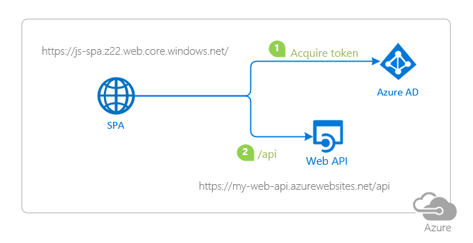

| In this Tutorial | Previous Tutorial | Next Tutorial |
|------------------|-------------------|---------------|
| deployment, storage accounts, app services | [Protect and call a web API](https://github.com/Azure-Samples/ms-identity-javascript-tutorial/tree/master/3-Authorization-II/3-1-call-api) | |

# Deploy your JavaScript Applications to Azure Cloud and use Azure Services to Manage your Operations

 1. [Overview](#overview)
 1. [Scenario](#scenario)
 1. [Prerequisites](#prerequisites)
 1. [Setup](#setup)
 1. [Registration](#registration)
 1. [Deployment](#deployment)
 1. [Running the sample](#running-the-sample)
 1. [Explore the sample](#explore-the-sample)
 1. [More information](#more-information)
 1. [Community Help and Support](#community-help-and-support)
 1. [Contributing](#contributing)
 1. [Code of Conduct](#code-of-conduct)

## Overview

This sample demonstrates how to deploy a JavaScript single-page application coupled with a Node.js web API to **Azure Cloud** using [Azure Storage](https://docs.microsoft.com/azure/storage/blobs/) and [Azure App Services](https://docs.microsoft.com/azure/app-service/), respectively. In doing so, it also illustrates various deployment concepts, such as [continuous deployment](https://docs.microsoft.com/azure/app-service/deploy-continuous-deployment), [credentials rotation](https://docs.microsoft.com/azure/key-vault/general/authentication), [CORS configuration](https://docs.microsoft.com/azure/app-service/app-service-web-tutorial-rest-api#enable-cors) and etc.

## Scenario

1. The client application uses the **MSAL.js** library to sign-in a user and obtain a JWT **Access Token** from **Azure AD**.
1. The **Access Token** is used as a **bearer** token to *authorize* the user to call the protected Web API.
1. The protected web API responds with the claims in the **Access Token**.



## Prerequisites

- [Node.js](https://nodejs.org/en/download/) must be installed to run this sample.
- A modern web browser. This sample uses **ES6** conventions and will not run on **Internet Explorer**.
- [Visual Studio Code](https://code.visualstudio.com/download) is recommended for running and editing this sample.
- [VS Code Azure Tools Extension](https://marketplace.visualstudio.com/items?itemName=ms-vscode.vscode-node-azure-pack) extension is recommended for interacting with **Azure** through VS Code interface.
- An **Azure AD** tenant. For more information, see: [How to get an Azure AD tenant](https://azure.microsoft.com/documentation/articles/active-directory-howto-tenant/)
- A user account in your **Azure AD** tenant.
- An **Azure subscription**. This sample uses **Azure Storage**, **Azure App Services**, **Azure Managed Identity** and **Azure Key Vault**.

## Setup

```console
    cd ms-identity-javascript-tutorial
    cd 3-Authorization-II-3-1-call-api
    cd API
    npm install
    cd..
    cd SPA
    npm install
```

## Registration

### Register the service app (Node.js web API)

Use the same app registration credentials that you've obtained during **chapter 3-1**.

### Register the client app (JavaScript SPA)

Use the same app registration credentials that you've obtained during **chapter 3-1**.

## Deployment

There are 3 alternatives for deploying your applications to **Azure Cloud**.

1. Use Azure Portal.
1. Use Azure CLI/Powershell
1. Use VS Code Azure Tools Extension

### Deploy the service app (Node.js web API)

#### Update your authentication parameters

### Deploy the client app (JavaScript SPA)

#### Update your authentication parameters

## Running the sample

```console
    cd ms-identity-javascript-tutorial
    cd 3-Authorization-II-3-1-call-api
    cd API
    npm start
    cd..
    cd SPA
    npm start
```

## Explore the sample

1. Open your browser and navigate to your deployed client app's URI, for instance: `http://localhost:3000`.
1. Click the **sign-in** button on the top right corner.
1. Once you authenticate, click the **Call API** button at the center.


> :thought_balloon: Consider taking a moment to [share your experience with us](https://forms.office.com/Pages/ResponsePage.aspx?id=v4j5cvGGr0GRqy180BHbR73pcsbpbxNJuZCMKN0lURpUNDVHTkg2VVhWMTNYUTZEM05YS1hSN01EOSQlQCN0PWcu).

## More information

- [Azure Blob Storage](https://docs.microsoft.com/azure/storage/blobs/)
- [Azure App Services](https://docs.microsoft.com/azure/app-service/)
- [Azure Managed Identity](https://docs.microsoft.com/azure/active-directory/managed-identities-azure-resources/)
- [Azure Key Vault](https://docs.microsoft.com/azure/key-vault/general/)

For more information about how OAuth 2.0 protocols work in this scenario and other scenarios, see [Authentication Scenarios for Azure AD](https://docs.microsoft.com/azure/active-directory/develop/authentication-flows-app-scenarios).

## Community Help and Support

Use [Stack Overflow](http://stackoverflow.com/questions/tagged/msal) to get support from the community.
Ask your questions on Stack Overflow first and browse existing issues to see if someone has asked your question before.
Make sure that your questions or comments are tagged with [`azure-ad` `azure-ad-b2c` `ms-identity` `adal` `msal`].

If you find a bug in the sample, please raise the issue on [GitHub Issues](../../issues).

To provide a recommendation, visit the following [User Voice page](https://feedback.azure.com/forums/169401-azure-active-directory).

## Contributing

If you'd like to contribute to this sample, see [CONTRIBUTING.MD](../../CONTRIBUTING.md).

This project has adopted the [Microsoft Open Source Code of Conduct](https://opensource.microsoft.com/codeofconduct/). For more information, see the [Code of Conduct FAQ](https://opensource.microsoft.com/codeofconduct/faq/) or contact [opencode@microsoft.com](mailto:opencode@microsoft.com) with any additional questions or comments.
