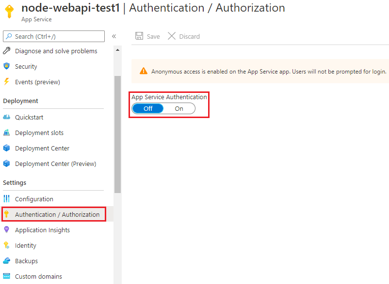
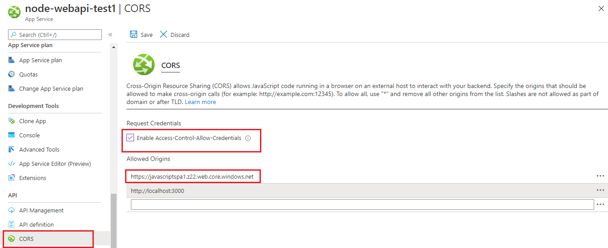
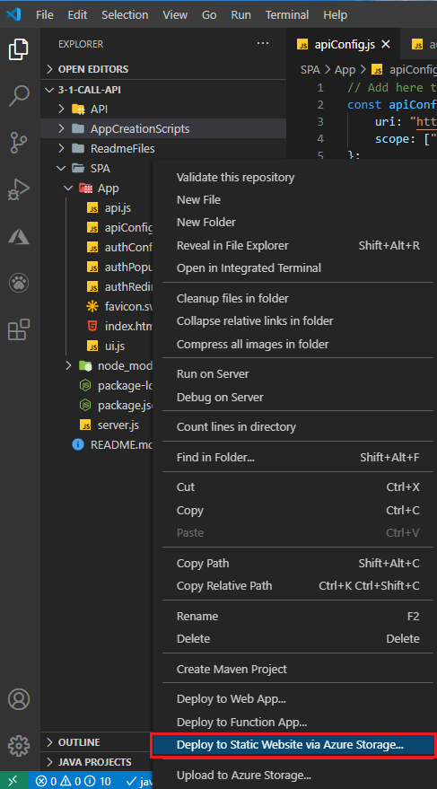
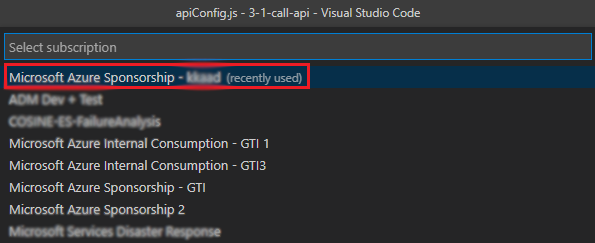

# Deploy your JavaScript Applications to Azure Cloud and use Azure Services to manage your operations

 1. [Overview](#overview)
 1. [Scenario](#scenario)
 1. [Prerequisites](#prerequisites)
 1. [Setup](#setup)
 1. [Registration](#registration)
 1. [Deployment](#deployment)
 1. [Explore the sample](#explore-the-sample)
 1. [More information](#more-information)
 1. [Community Help and Support](#community-help-and-support)
 1. [Contributing](#contributing)
 1. [Code of Conduct](#code-of-conduct)

## Overview

This sample demonstrates how to deploy a JavaScript single-page application (SPA) coupled with a Node.js web API to **Azure Cloud** using [Azure Storage](https://docs.microsoft.com/azure/storage/blobs/) and [Azure App Service](https://docs.microsoft.com/azure/app-service/), respectively. To do so, we will use the same code sample from Chapter 3 (3-Authorization-II/3-1-call-api).

## Scenario

1. The client application uses the **MSAL.js** library to sign-in a user and obtain a JWT **Access Token** from **Azure AD**.
1. The **Access Token** is used as a **bearer** token to *authorize* the user to call the protected Web API.
1. The protected web API responds with the claims in the **Access Token**.


## Prerequisites

- [Node.js](https://nodejs.org/en/download/) must be installed to run this sample.
- A modern web browser. This sample uses **ES6** conventions and will not run on **Internet Explorer**.
- [Visual Studio Code](https://code.visualstudio.com/download) is recommended for running and editing this sample.
- [VS Code Azure Tools Extension](https://marketplace.visualstudio.com/items?itemName=ms-vscode.vscode-node-azure-pack) extension is recommended for interacting with **Azure** through VS Code interface.
- An **Azure AD** tenant. For more information, see: [How to get an Azure AD tenant](https://azure.microsoft.com/documentation/articles/active-directory-howto-tenant/)
- A user account in your **Azure AD** tenant.
- An **Azure subscription**. This sample uses **Azure Storage** and **Azure App Service**.

## Setup

- Setup the service app:

```console
    cd ms-identity-javascript-tutorial
    cd 3-Authorization-II/3-1-call-api
    cd API
    npm install
```

- Setup the client app:

```console
    cd ..
    cd SPA
    npm install
```

## Registration

### Register the service app (Node.js web API)

Use the same app registration credentials that you've obtained during [**chapter 3-1**](../3-Authorization-II/3-1-call-api).

### Register the client app (JavaScript SPA)

Use the same app registration credentials that you've obtained during [**chapter 3-1**](../3-Authorization-II/3-1-call-api).

## Deployment

There are basically **3** stages that you will have to go through in order to deploy your projects and enable authentication:

1. Upload your project files to **Azure** services and obtain published website URIs
1. Update **Azure AD** **App Registration** with URIs you have just obtained
1. Update your configuration files with URIs you have just obtained

### Deploy the service app (Node.js web API)

There are various ways to deploy your applications to **Azure App Service**. Here we provide steps for deployment via **VS Code Azure Tools Extension**. For more alternatives, visit: [Static website hosting in Azure Storage](https://docs.microsoft.com/azure/storage/blobs/storage-blob-static-website#uploading-content).

> We recommend watching the [video tutorial](https://docs.microsoft.com/azure/developer/javascript/tutorial-vscode-azure-app-service-node-01) offered by Microsoft Docs for preparation.

#### Step 1: Deploy your app

1. In the **VS Code** activity bar, select the **Azure** logo to show the **AZURE APP SERVICE** explorer. Select **Sign in to Azure...** and follow the instructions. Once signed in, the explorer should show the name of your **Azure** subscription(s).


2. On the **App Service** explorer section you will see an upward-facing arrow icon. Click on it publish your local files in the `API` folder to **Azure App Services**.


3. Choose a creation option based on the operating system to which you want to deploy. in this sample, we choose **Linux**.

4. Select a Node.js version when prompted. An **LTS** version is recommended.

5. Type a globally unique name for your web app and press Enter. The name must be unique across all of **Azure**.

6. After you respond to all the prompts, **VS Code** shows the **Azure** resources that are being created for your app in its notification popup.

7. Select **Yes** when prompted to update your configuration to run npm install on the target Linux server.


#### Step 2: Disable default authentication

Now you need to navigate to the **Azure App Service** Portal, and locate your project there. Once you do, click on the **Authentication/Authorization** blade. There, make sure that the **App Services Authentication** is switched off (and nothing else is checked), as we are using **our own** authentication logic.  



#### Step 3: Enable cross-origin resource sharing (CORS)



### Deploy the client app (JavaScript SPA)

There are various ways to deploy your applications to **Azure Storage**. Here we provide steps for deployment via **VS Code Azure Tools Extension**. For more alternatives, visit: [Static website hosting in Azure Storage](https://docs.microsoft.com/azure/storage/blobs/storage-blob-static-website#uploading-content).

> We recommend watching the [video tutorial](https://docs.microsoft.com/azure/developer/javascript/tutorial-vscode-static-website-node-01) offered by Microsoft Docs for preparation.

#### Step 1: Deploy the app

Create a distributable files folder, where your `html`, `css` and `javascript` files will be located (in the sample, the `SPA/App/` folder is already usable for this). Then follow the steps below:

1. Right click on the `SPA/App/` folder inside. This will open a context menu where you will see the option **Deploy to static website via Azure Storage**. Click on it.



2. Follow the dialog window that opens on the top. Select your subscription, then give a name to your storage account.



3. Once your storage account is created and your files are uploaded, you will see a notification on the bottom-right corner of VS Code interface. When it's done, you will be notified with the published URI of your static website (e.g. `https://javascriptspa1.z22.web.core.windows.net/`).


#### Step 2: Update the client app's authentication parameters

1. Navigate back to to the [Azure Portal](https://portal.azure.com).
1. In the left-hand navigation pane, select the **Azure Active Directory** service, and then select **App registrations**.
1. In the resulting screen, select the name of your application.
1. From the *Branding* menu, update the **Home page URL**, to the address of your service, for example [https://javascriptspa1.z22.web.core.windows.net/](https://javascriptspa1.z22.web.core.windows.net/). Save the configuration.
1. Add the same URI in the list of values of the *Authentication -> Redirect URIs* menu. If you have multiple redirect URIs, make sure that there a new entry using the App service's URI for each redirect URI.

#### Step 3: Update the client app's configuration files

Now you need to update your authentication configuration files in the client project. To do so, go to your **Azure Storage Account** explorer via **VS Code** Azure panel. There, click on your project's name > Blob Container > Web as shown below:


Open `authConfig.js`. Then:

1. Find the key `redirectUri` and replace the existing value with your static webpage's URI that you have just registered e.g. `https://javascriptspa1.z22.web.core.windows.net/`

Open `apiConfig.js`. Then:

1. Find the key `uri` and replace the existing value with your published web API's endpoint, e.g. `https://node-webapi-1.azurewebsites.net/api`

## Explore the sample

1. Open your browser and navigate to your deployed client app's URI, for instance: `https://javascriptspa1.z22.web.core.windows.net/`.
1. Click the **sign-in** button on the top right corner.
1. Once you authenticate, click the **Call API** button at the center.


## We'd love your feedback!

Were we successful in addressing your learning objective? Consider taking a moment to [share your experience with us](https://forms.office.com/Pages/ResponsePage.aspx?id=v4j5cvGGr0GRqy180BHbR73pcsbpbxNJuZCMKN0lURpUNDVHTkg2VVhWMTNYUTZEM05YS1hSN01EOSQlQCN0PWcu).

## More information

- [Azure Blob Storage](https://docs.microsoft.com/azure/storage/blobs/)
- [Azure App Services](https://docs.microsoft.com/azure/app-service/)

For more information about how OAuth 2.0 protocols work in this scenario and other scenarios, see [Authentication Scenarios for Azure AD](https://docs.microsoft.com/azure/active-directory/develop/authentication-flows-app-scenarios).

## Community Help and Support

Use [Stack Overflow](http://stackoverflow.com/questions/tagged/msal) to get support from the community.
Ask your questions on Stack Overflow first and browse existing issues to see if someone has asked your question before.
Make sure that your questions or comments are tagged with [`azure-ad` `azure-ad-b2c` `ms-identity` `msal`].

If you find a bug in the sample, please raise the issue on [GitHub Issues](../../issues).

To provide a recommendation, visit the following [User Voice page](https://feedback.azure.com/forums/169401-azure-active-directory).

## Contributing

If you'd like to contribute to this sample, see [CONTRIBUTING.MD](../../CONTRIBUTING.md).

This project has adopted the [Microsoft Open Source Code of Conduct](https://opensource.microsoft.com/codeofconduct/). For more information, see the [Code of Conduct FAQ](https://opensource.microsoft.com/codeofconduct/faq/) or contact [opencode@microsoft.com](mailto:opencode@microsoft.com) with any additional questions or comments.
